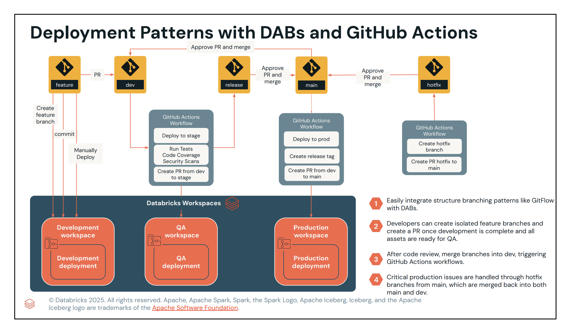

Topic:

- Deploying Databricks Projects
    - CI/CD Journey to Production
- Introduction to Databricks Asset Bundles (DABs)
    - Top-Level Mappings in Databricks Asset Bundles (DABs)
- Demo: Deploying a Simple DAB


# Learning Objectives

By the end of this week, you’ll be able to:

- Understand core DevOps principles, including continuous integration (CI), continuous deployment (CD), and testing, and how they apply to Databricks projects.

- Evaluate tools for continuous deployment of Databricks projects, such as the Databricks REST API, SDK, and CLI.

- Explore the benefits of Databricks Asset Bundles, including their folder structure and key components, for continuous deployment.

- Validate, deploy, and run Databricks Asset Bundles using the Databricks CLI across multiple environments with different configurations.

- Use Visual Studio Code for developing, testing, and deploying Databricks Asset Bundles.

- Automate deployment pipelines for Databricks projects using GitHub Actions and Databricks Asset Bundles to streamline the CI/CD process.

## DevOps and CI/CD Review
we’ll provide a comprehensive overview of DevOps and Continuous Integration/Continuous Deployment (CI/CD) concepts. We’ll explore tools for continuous deployment in Databricks, including the REST API, SDK, and CLI, and provide a brief demo on course setup and authentication.

- Understand and apply the core principles of DevOps and CI/CD.

- Leverage tools for continuous deployment, including the REST API, SDK, and CLI, to streamline Databricks workflows.

- Automate the deployment of notebooks, jobs, and clusters effectively.

- Evaluate the benefits and trade-offs of different deployment tools to choose the best fit for your needs.

- Set up and authenticate Databricks projects with practical insights from a hands-on demo.


**DevOps** is a culture and set of practices that combines software engineering best practices with IT operations. Its core purpose is to **bridge the gap between development and operations teams**, fostering collaboration to automate workflows and streamline processes. This allows organizations to build and deliver software more rapidly, efficiently, and with higher quality. 

The **DevOps lifecycle** is an iterative process focused on continuously integrating, testing, and deploying code. The lifecycle steps include:
*   Planning, coding, building, and testing
*   Releasing, deploying, operating, and monitoring
*   Continuously iterating through these stages as a project requires new features, fixes, or updates

The **key benefits** of adopting DevOps include:
*   Faster deployment cycles
*   Improved collaboration between teams
*   Enhanced system reliability
*   Better scalability and efficiency

Additionally, the fundamental principles of DevOps—such as automation, testing, and continuous improvement—can be applied to specialized domains:
*   **DataOps:** This is essentially DevOps for data engineering. It automates the management of data pipelines to optimize data flow and quality, ensuring reliable transitions from collection to processing with fewer bottlenecks.
*   **MLOps:** This applies DevOps principles to machine learning. It streamlines the deployment and management of machine learning models, moving them efficiently from development into production while continually monitoring their performance.

# Continuous Integration and Continuous Deployment/Delivery (CI/CD)

**Continuous Integration (CI) and Continuous Deployment/Delivery (CD)** are subsets of DevOps practices focused on automating how code is integrated, tested, and delivered. 

**The Role of CI/CD in DevOps**
*   **Continuous Integration (CI):** This process involves frequently merging code changes from multiple contributors into a central repository. Automated tests run immediately to ensure code quality; if tests fail, the commit is stopped from entering the source code. CI helps detect issues early, accelerates development cycles, and ensures existing features remain stable. Within CI, you typically rely on a testing pyramid that ranges from fast, isolated **unit tests**, to **integration tests** that check how components interact, up to comprehensive **system tests** that validate the entire end-to-end pipeline.
*   **Continuous Delivery:** This automates the push of integrated changes into staging or pre-production environments, but leaves the final deployment to production as a manual step. 
*   **Continuous Deployment:** This takes automation a step further by removing manual intervention; any code change that successfully passes all automated tests is immediately deployed straight to production.

**Environment Isolation**
To build a reliable CI/CD pipeline, organizations must isolate their environments (such as Dev, Stage, and Prod) so that code is thoroughly tested before it reaches the production stage. In Databricks, this isolation is typically achieved by setting up **multiple workspaces** or **multiple catalogs**, dedicating one to each specific environment.
*   **Development Data:** Often uses anonymized or synthetic datasets to allow for rapid, safe development without compromising real data integrity.
*   **Staging Data:** Closely mirrors the structure and volume of production data to ensure realistic testing, but sensitive information is typically scrubbed or anonymized.
*   **Production Data:** Live, fully operational data containing real user information, requiring the highest security, privacy, and compliance standards.

**Deployment Tools in Databricks**
Databricks offers several tools for deploying projects and infrastructure:
*   **Databricks REST API:** Allows direct access to Databricks functionality via HTTP requests, though you must manually construct these requests and handle the responses.
*   **Databricks SDK:** Supports languages like Python, Java, Go, and R, providing an accelerated way to interact with all public REST API operations.
*   **Databricks CLI (Command Line Interface):** An easy-to-use tool for automating tasks from the terminal or bash scripts. Crucially, the CLI allows you to use **Databricks Asset Bundles (DABs)** to define and manage your infrastructure as code. 

You can interact with the Databricks CLI in a few different environments:
*   **Web Terminal:** Run shell commands directly in the Databricks UI using the current user's authentication and the latest CLI version.
*   **VS Code:** Install the CLI locally and authenticate to Databricks, often utilizing the Databricks VSCode Extension for additional features.
*   **Databricks Notebooks:** Use the `%sh` magic command to run shell scripts directly in a notebook, which requires token authentication to utilize the CLI.

## Deployment Tools in Databricks

Databricks provides three primary tools for deploying projects and managing infrastructure within your CI/CD pipelines:

*   **Databricks REST API:** This provides direct access to Databricks functionality through HTTP requests. When using the API, you must manually construct these HTTP requests and handle the returned responses yourself.
*   **Databricks SDK:** The SDK accelerates development and deployment by wrapping all public Databricks REST API operations. It is highly versatile and supports multiple programming languages, specifically **Python, Java, Go, and R**.
*   **Databricks CLI (Command Line Interface):** This provides an easy-to-use interface for automating tasks directly from a terminal, command prompt, or bash scripts. A key feature of the CLI is that it allows you to use **Databricks Asset Bundles (DABs)**, which enables you to define and write your infrastructure as code.

If you choose to use the **Databricks CLI**, there are several different environments you can operate it from depending on your workflow:

*   **Web Terminal:** You can run CLI commands directly from the Databricks web interface. It automatically uses the latest version of the CLI and handles authentication based on your current user session. Keep in mind that this feature must be explicitly enabled in your environment before you can use it.
*   **VS Code:** You can install and run the CLI locally within your Integrated Development Environment (IDE). This setup requires you to manually authenticate to your Databricks Workspace. You can also install the **Databricks VSCode Extension** to gain additional features that enhance your development process.
*   **Databricks Notebooks:** You can execute shell commands directly inside a notebook by using the **`%sh`** magic command, which allows you to install and interact with the CLI. To use the CLI this way, you must authenticate using a token to ensure secure access to your workspace. While notebooks are excellent and simple for learning CLI commands, they may not be the best approach for a true production environment.

## 🚀 Databricks Command Line Interface (CLI)

The **Databricks Command Line Interface (CLI)** provides an easy-to-use interface for automating tasks directly from a terminal, command prompt, or bash scripts.  
A major advantage of using the CLI is that it allows you to leverage **Databricks Asset Bundles (DABs)**, which enable you to define and manage your Databricks infrastructure as code.

---

## 🌐 Primary Environments for Using the CLI

### 1. **Web Terminal**
- Run CLI commands directly from the Databricks web interface.  
- Defaults to the latest version of the CLI.  
- Automatically handles authentication based on the current user's permissions.  
- ⚠️ Must be explicitly enabled in your environment before use.

---

### 2. **VS Code**
- Install and run the Databricks CLI locally within an IDE such as VS Code.  
- Requires manual authentication to your Databricks Workspace.  
- Use the **Databricks VSCode Extension** for enhanced development features.

---

### 3. **Databricks Notebooks**
- Interact with the CLI inside a notebook using the **`%sh`** magic command.  
- Authenticate securely using a token.  
- Great for simplicity and learning.  
- ⚠️ Not recommended for managing production environments.

---

# Demo : Course Setup and Authentication

- Initial setup involves configuring a compute cluster and creating catalogs for development, staging, and production environments.

- Personal access tokens are used for authentication and must be stored securely, not in plain text, to prevent unauthorized access.

- Installing and configuring the Databricks CLI within a notebook environment simplifies command execution, with authentication handled through stored credentials.

- Generating and managing personal access tokens allows you to authenticate the Databricks CLI effectively.

# Deployment with Databricks Asset Bundles (DABs)

- Explain the components and goals of deploying Databricks projects across multiple environments using different configurations.

- Describe DABs, including their benefits, core components, and the deployment challenges they address.

- Validate, deploy, and execute DABs in various environments.

- Use variable substitution in DABs to enable dynamic, environment-specific configurations.

- Implement a CI/CD pipeline to deploy a Databricks project efficiently across environments.

# Deploying Databricks Projects


## 📦 Typical Databricks Project Structure

A typical Databricks project consists of multiple components:
- **Code**: Notebooks, Python files, or JARs  
- **Execution Environment**: Workspace and compute configurations  
- **Resources**: Lakeflow Jobs, MLflow, Declarative Pipelines  

When deployed, the goal is to deliver **data products** such as tables, ML models, pipelines, or dashboards.

---

## 🔄 CI/CD Journey Across Environments

Organizations typically follow a CI/CD journey across isolated environments, driven by version control (dev, stage, main branches):

### 1. **Development Deployment**
- Deploy to the **dev environment** to test updates.  
- Uses **single-node compute**.  
- Runs under your **personal user account**.  
- Development data is usually small.

---

### 2. **Staging Deployment**
- Code moves to **staging** after a pull request.  
- Mirrors real-world conditions with **Serverless compute**.  
- Executes via a **service principal** identity.  
- Provides better security by granting automated tools only the access they need.

---

### 3. **Production Deployment**
- Deployed to the **main branch** after staging tests pass.  
- Uses **live production data**.  
- Runs on **Serverless compute** with a **service principal**.  
- Typically scheduled for automated execution.

---

## ⚙️ Orchestrating the Deployment

There are several ways to orchestrate this journey:

- **Manually (UI):** Easy to learn but error-prone and not suitable for CI/CD.  
- **Programmatically (REST API / SDK):** Offers low-level control but requires scripting effort.  
- **Terraform:** Powerful IaC tool, but steep learning curve for data scientists/engineers.  

---

## 🚀 Databricks Asset Bundles (DABs)

To simplify CI/CD, Databricks recommends **Databricks Asset Bundles (DABs)**:
- Write code once, deploy across multiple environments.  
- **Co-version code and configurations using YAML**.  
- YAML is human-readable and makes it easy to:
  - Define Databricks resources  
  - Ensure user isolation during deployment  
  - Apply environment-specific variables and overrides  

---

## 📊 Simple Databricks Project Components

A **simple Databricks project** consists of three primary categories of components that work together to produce data products like tables, pipelines, or dashboards:

- **Code:** The actual logic of your project, typically written in **Python, SQL, or R notebooks**.  
- **Resources:** The tools used to orchestrate and process your code, such as **Lakeflow Jobs**, **Lakeflow Declarative Pipelines** (or Delta Live Tables), and workflows.  
- **Execution Environment:** The underlying infrastructure where your project runs and data is managed. This includes your **Databricks Workspace**, **Unity Catalog** (for data governance and catalogs), and your specific **compute configurations**.  

---

## 🛠️ Examples of Project Types

- **Basic Project (Simple Report):**  
  - One notebook  
  - Runs on **single-node compute**  

- **Simple Data Engineering Project:**  
  - Mix of notebooks  
  - Delta Live Tables (DLT)  
  - Workflow orchestration  
  - Unity Catalog catalogs  
  - Compute configurations specific to the pipeline  

---

## 🚀 Deployment with Databricks Asset Bundles (DABs)

As discussed earlier, these components can all be **co-versioned and deployed** across your **development, staging, and production environments** using **Databricks Asset Bundles (DABs)**.  

- DABs allow you to **write once, deploy anywhere**.  
- They use **YAML configuration** to:  
  - Define Databricks resources  
  - Ensure user isolation during deployment  
  - Apply environment-specific variables and overrides  

---

## 🔄 CI/CD Journey to Production

A typical **CI/CD journey to production** follows a structured progression across isolated environments, driven by a robust **version control strategy** that generally utilizes `dev`, `stage`, and `main` branches.  

---

## 🚧 Deployment Stages

### 1. **Development Deployment (`dev` branch)**
- Deploy your Databricks project to the **development environment** to test updates or new features.  
- Uses **single-node compute**.  
- Executed under your personal **user account**.  
- Development datasets are generally small.  

---

### 2. **Staging Deployment (`stage` branch)**
- After development, create a **pull request** to merge updates into the staging branch.  
- Deploys the project to the **staging environment**.  
- Testing continues against staging data with real-world configurations.  
- Uses **Serverless compute** for scalability.  
- Executes via a **service principal** identity for enhanced security.  

---

### 3. **Production Deployment (`main` branch)**
- After passing all tests in dev and stage, code is deployed to **production**.  
- Uses **live production data**.  
- Runs on **Serverless compute** with a **service principal**.  
- Typically scheduled on a **weekly basis** to refresh data for end consumers.  

---

## ⚙️ Simplifying Orchestration with DABs

Instead of relying on:
- ❌ Manual UI updates (error-prone, time-consuming)  
- ❌ Complex custom API scripts (requires deep API knowledge)  

Databricks recommends **Databricks Asset Bundles (DABs)**:  
- Co-version your **project code and configurations** using **YAML**.  
- YAML makes it easy to:  
  - Define environment-specific variables and overrides  
  - Switch seamlessly from **single-node compute → Serverless compute**  
  - Ensure smooth progression from **development → staging → production**  

---

## 🚀 Key Benefit
With **DABs**, you **write once and deploy everywhere**, making CI/CD in Databricks **simple, reliable, and scalable**.


# Introduction to Databricks Asset Bundles (DABs)


# 🚀 Databricks Asset Bundles (DABs)

Databricks Asset Bundles (DABs) embody the principle of **"write code once, deploy everywhere"**.  
They use simple **YAML files** to specify the artifacts, resources, and configurations of a Databricks project.  

DABs are especially useful during **development** and **CI/CD** because they allow you to:
- Deploy Databricks assets across different target environments  
- Easily modify specific configurations for each environment  

---

## 📂 Typical Project Structure

A simple DAB project typically includes:

- **`databricks.yml`** → Required configuration file, the heart of the bundle  
- **`src/` folder** → Source files (notebooks, Python scripts)  
  - *Note: As of Dec 20, 2024, the default format for new notebooks is `.ipynb`. Always specify the correct extension to avoid errors.*  
- **`tests/` folder** → Unit and integration tests for your pipeline  
- **`resources/` folder** → Additional YAML configuration files  

---

## 📝 The `databricks.yml` Configuration File

This required YAML file must contain at least one **top-level mapping**:

- **`bundle`** → Required name of the bundle + optional workspace settings  
- **`resources`** → Defines Databricks resources (Lakeflow Jobs, Declarative Pipelines, MLflow)  
  - Each resource must have a **unique name**  
- **`targets`** → Maps environments (`development`, `production`)  
  - Define environment modes  
  - Apply configuration overrides  
  - Set a **default target environment**  

Other optional mappings: `variables`, `workspace`, `permissions`, `artifacts`, `include`, `sync`.

---

## 🔄 Managing the DAB Lifecycle

The Databricks CLI provides commands to validate, deploy, and run bundles:

- **Validate**  
  ```bash
  databricks bundle validate
  ```

  Evaluates configuration files and warns if unknown resource properties are found.  

- **Deploy**  
  ```bash
  databricks bundle deploy -t <environment>
  ```
  Deploys your bundle into a target environment (e.g., `-t development`). default is development 
  *Best practice: always specify the environment explicitly.*  

- **Run**  
  ```bash
  databricks bundle run -t <environment> <job_key>
  ```
  Executes your deployed bundle in the specified environment.  
  Requires the **exact job key name** defined in your `resources` mapping.  

---

## ✅ Key Takeaway

With **DABs**, you can **co-version your code and configurations** in YAML, making it simple to:
- Define resources  
- Ensure isolation during deployment  
- Apply environment-specific overrides  
- Seamlessly move from **development → staging → production**

# 📑 Top-Level Mappings in Databricks Asset Bundles (DABs)

In Databricks Asset Bundles (DABs), **top-level mappings** are the primary configuration sections defined within the required `databricks.yml` file.  
This configuration file must contain at least the **`bundle`** mapping to function.

---

## 🔹 Common Top-Level Mappings

### 1. **`bundle`**
- Associates the entire contents of your bundle with a **required name**.  
- A configuration file can contain **only one** top-level `bundle` mapping.  
- Can also include optional Databricks workspace settings such as:  
  - `cluster_id`  
  - `compute_id`  
  - `git`  

---

### 2. **`resources`**
- Defines the specific Databricks resources used by the bundle.  
- Examples: **Lakeflow Jobs**, **Lakeflow Declarative Pipelines**, **MLflow**.  
- Resources are defined using parameters that correspond to the **Databricks REST API**.  
- Every resource declared must have a **unique name**.  

---

### 3. **`targets`**
- Specifies your **target environments** (e.g., `development`, `production`).  
- Allows you to configure:  
  - Environment mode types  
  - Configuration overrides for specific environments  
  - A **default target environment** (used if none is explicitly stated)  

---

## ⚙️ Other Optional Top-Level Mappings

In addition to the primary components, the `databricks.yml` file can also include:  
- **`variables`**  
- **`workspace`**  
- **`permissions`**  
- **`artifacts`**  
- **`include`**  
- **`sync`**  

---

## ✅ Key Takeaway
Top-level mappings in `databricks.yml` provide a **structured way to define, organize, and deploy** Databricks projects across environments, ensuring consistency and flexibility in CI/CD workflows.

# Demo: Deploying a Simple DAB

- Deploy a simple job using Databricks Asset Bundles and the Databricks CLI.

- Manually create a job, review its YAML configuration, and use it for deployment.

- Validate, deploy, and run a Databricks Asset Bundle in a development environment.

- Use relative paths and the correct notebook file extensions in the YAML configuration.

- Update and redeploy a job, and clean up resources by destroying the asset bundle.


```bash
bundle:
  name: "DAB-Demo"
  uuid: "05622722-fb3a-4a17-8f1f-c3c1d37ececb"

variables:
  git_branch:
    description: "Git branch to use for job source code"
  demo_parameter_value:
    description: "Text value to pass as a Databricks notebook parameter"

presets:
  tags:
    application: "Demo Notebook"

targets:
  free:
    mode: development
    workspace:
      host: https://dbc-e667f434-e97e.cloud.databricks.com
    variables:
      git_branch: main
      demo_parameter_value: "Hello, World!"

resources:
  jobs:
    run_demo_notebook:
      name: run_demo_notebook_job
      tasks:
        - task_key: run_demo_notebook_task
          notebook_task:
            notebook_path: demo_notebook
            base_parameters:
              demo_parameter: ${var.demo_parameter_value}
            source: GIT
      git_source:
        git_url: https://gontcharovd@dev.azure.com/gontcharovd/databricks-dab-demo/_git/databricks-dab-demo
        git_provider: azureDevOpsServices
        git_branch: ${var.git_branch}
      schedule:
        quartz_cron_expression: "0 0 7 * * ?"  # Daily at 7:00 AM UTC
        timezone_id: "UTC"
```

# Variable Substitutions in DABs

## 🔧 Variables in Databricks Asset Bundles (DABs)

Variables make your `databricks.yml` configuration files **modular and reusable** by allowing dynamic retrieval of values at deployment and runtime.  
To reference a variable, enclose the mapping and variable name in `${...}`, for example:  
```yaml
${var.variable_name}
```

---

## 📌 Four Primary Ways to Use Variables

### 1. **Default Substitutions**
- Built-in variables available out of the box.  
- Examples:  
  - `${bundle.target}` → retrieves the current target environment  
  - `${workspace.file_path}`  
  - `${resources.jobs.<job-name>.id}`
  - `${resources.models.<model-name>.name}`
  - `${resources.pipelines.<pipeline-name>.name} `

---

### 2. **Simple Custom Variables**
- Declared in the top-level **`variables`** mapping.  
- Default type: **string**.  
- Useful for concatenation.  
- Example:  
  ```yaml
  target_catalog: ${var.my_lab_user_name}_1_dev
  ```

---

### 3. **Complex Variables**
- Type set to **`complex`** for structured, nested data.  
- Useful for infrastructure definitions (e.g., cluster configs).  
- Example:  
  ```yaml
  cluster_config:
    type: complex
    value:
      spark_version: 13.3.x-scala2.12
      node_type_id: i3.xlarge
      num_workers: 4
  ```

---

### 4. **Lookup Variables**
- Dynamically resolve Databricks object IDs by name.  
- Ensures correct IDs are always used during deployment.  
- Supported for: clusters, jobs, pipelines, warehouses, service principals, dashboards.  

---

## 🎯 Target Environment Overrides

Variables integrate directly with the **`targets`** mapping to adjust configurations across environments:  
- Define **environment overrides** so variable values change dynamically.  
- Example:  
  ```yaml
  variables:
    target_catalog: dev_catalog   # default value

  targets:
    production:
      variables:
        target_catalog: prod_catalog
  ```

- **Important:** A default value must be defined in the main `variables` mapping.  
- If no override is specified, the bundle falls back to the default.  

---

## ✅ Key Benefits
- Reduce risk of **hard-coding errors**  
- Make environments **highly customizable**  
- Enable **consistent reuse** of asset bundles across teams and workspaces  

## 📌 Lookup Variables
Lookup variables allow you to **dynamically retrieve a Databricks object's underlying ID** by referencing its name.  
- Instead of hardcoding numeric IDs, you define the variable using the `lookup` mapping.  
- Example:  
  ```yaml
  variables:
    my_cluster:
      lookup:
        cluster: myclustername
  ```
- The variable automatically resolves to the correct **cluster ID** during deployment.  
- Supported object types: **clusters, jobs, pipelines, dashboards, warehouses, service principals**.  

✅ Benefit: Ensures the **correctly resolved ID** is always used, reducing errors.

---

## 🎯 Target Environment Overrides
Overrides build on the **`targets`** top-level mapping to seamlessly move projects through the CI/CD journey.  
They allow you to **dynamically modify variable values** depending on the environment.

### Example: Switching Catalogs
```yaml
variables:
  target_catalog: dev_catalog   # default value

targets:
  development:
    variables:
      target_catalog: dev_catalog

  production:
    variables:
      target_catalog: prod_catalog
```

### Key Rules
- If no override is specified → falls back to the **default value**.  
- A **default value must be defined** in the main `variables` mapping.  
- Without a default, overrides will not function correctly.  

---

## 🚀 Combined Power
By combining **lookup variables** and **environment overrides**, you can:
- Use the **same asset bundle** across multiple teams, workspaces, and environments.  
- Dynamically adjust configurations without hardcoding.  
- Reduce risk of deployment errors.  

# Demo: Deploying a DAB to Multiple Environments

- Configuring environment-specific settings
- Utilizing YAML files for modularization
- Executing deployments with variable substitutions for dynamic adjustments.


- Deploy a Databriks project using DABs to both development and production environments.
- Modify configurations for each environment using variables and top-level mapping for modularization.
- Dynamically replace job parameters based on the target environment.
- Organize YAML configurations for scalable project management.
- Deploy to multiple environments with different configurations and data sets

That’s a solid breakdown of how Databricks Asset Bundles (DABs) leverage templates. Let me add a bit of nuance that can help when you’re actually setting these up in practice:

# DAB Project Templates Overview

### 🚀 Default Templates
- **Quick start advantage**: They’re great for prototyping or when you want to align with Databricks’ recommended structures.  
- **Interactive vs. automatic init**: Running `databricks bundle init <template_name>` outside a notebook gives you flexibility (prompts for variables, folder names, etc.), while inside a notebook it skips prompts and scaffolds everything directly.  
- **Best use cases**:
  - `default-python`: ETL pipelines, data engineering scripts.
  - `default-sql`: Analytics dashboards, reporting queries.
  - `dbt-sql`: When you want dbt’s transformation logic tightly integrated.
  - `mlops-stacks`: End-to-end ML lifecycle (training, deployment, monitoring).

### 🛠️ Custom Templates
- **Minimum requirements**:
  - `databricks_template_schema.json`: Defines the schema for prompts and variables.
  - `databricks.yml.tmpl`: Acts as the blueprint for the generated bundle.  
- **Customization options**:
  - Add **user prompts** (e.g., “Enter environment name”) to enforce consistency.
  - Define **folder structures** (e.g., `src/`, `tests/`, `resources/`) so every project starts standardized.
  - Bake in **(Infrastructure As Code) IaC patterns** (permissions, artifacts, sync rules) so teams don’t reinvent them.  
- **Initialization**: `databricks bundle init /projects/templates/test-template` (local path) or remote URL if you host templates centrally.

### ⚖️ When to Choose Which
| Scenario | Best Option |
|----------|-------------|
| Rapid prototyping | Default templates |
| Enterprise-wide consistency | Custom templates |
| Complex ML lifecycle | `mlops-stacks` default |
| dbt-centric workflows | `dbt-sql` default |
| Custom governance/security needs | Custom templates |


# CI/CD Project Overview with DABs

## Planning a Databricks Project for CI/CD with Asset Bundles (DABs)

When planning a Databricks project for a CI/CD workflow using **Databricks Asset Bundles (DABs)**, you need to clearly define three core components: your deliverables, the necessary tasks, and the specific Databricks assets required.

---

## 🎯 Deliverables
Identify exactly what you are building, such as a solution to visualize health data.

---

## 📝 Tasks
Outline the key steps needed to achieve this deliverable. For a typical data pipeline, this might involve:
- Ingesting daily incremental CSV files into a **bronze table**  
- Cleaning the data for a **silver table**  
- Creating **gold tables** to share with your end consumers  

---

## ⚙️ Databricks Assets
Determine the exact infrastructure components you need to build the project, which often include:
- Databricks Workspace  
- Notebooks  
- Delta Live Tables (or Lakeflow Declarative Pipelines)  
- Workflows  
- Compute resources  

---

## 🏗️ Environment Architecture and Data Isolation
Building on our previous discussions about environment isolation, your project plan should define how data is managed across your `dev`, `stage`, and `prod` stages. You can achieve this by assigning specific catalogs to each environment:

- **Dev Catalog:** Contains a small, static subset of production data for development and initial testing.  
- **Stage Catalog:** Holds a larger subset of production data, allowing for more comprehensive testing as your code moves through the CI/CD process.  
- **Prod Catalog:** Reserved for the live operational data you rely on for final production operations.  

---

## ✅ Testing and Execution Strategy
A well-planned project must also incorporate a robust testing strategy built around the **testing pyramid**, which includes unit, integration, and system tests.

### Unit Tests
- Fast, low-cost tests for individual isolated functions (like a custom PySpark function).  
- Commonly written using **pytest**, which automatically discovers tests and provides detailed error messages when a failure occurs.  

### Integration Tests
- Evaluate the interactions between different components, such as notebooks and data pipelines.  
- Leverage **Lakeflow Declarative Pipeline expectations**, which are data quality constraints designed to automatically validate your data before it moves further down the pipeline.  

---

## 🔄 Orchestration
Ultimately, your project workflow should be orchestrated using **Databricks Workflows (Lakeflow Jobs)** to automatically execute these tests alongside your data pipelines and final visualizations. By thoroughly validating the pipeline at each stage, you can ensure everything is functioning correctly before deploying your work to production.

## 🧪 Unit Tests in the CI/CD Testing Pyramid

As we discussed during your project planning, **unit tests form the essential base of the CI/CD testing pyramid**.  
Because they evaluate individual functions or methods (such as custom PySpark functions) in strict isolation, they are fast, inexpensive to run, and highly automated, giving you the broadest coverage across your codebase.

---

## ⚡ Why Pytest?
**Pytest** is a highly popular Python testing framework designed to make writing these foundational unit tests both simple and scalable.  
It is an excellent choice for automated data pipelines due to several key advantages:

- **Simple Syntax:** No complex boilerplate or setup. Just write your test functions with the **`test_` prefix**.  
- **Automatic Discovery:** Pytest automatically locates and runs all tests using the `test_` naming convention for files and functions.  
- **Detailed Assertions:** Uses Python’s standard **`assert` statements** (and PySpark-specific assertions) to generate detailed error messages when a test fails, accelerating debugging.  
- **Rich Ecosystem:** Easily extendable with plugins for **parallel test execution, code coverage reporting, and integration with other tools**.  

---

## 📂 Integration into Databricks Asset Bundles (DABs)
When integrated into your **Databricks Asset Bundles (DABs)** project structure:
- Pytest scripts are typically placed in the dedicated **`tests/` folder**.  
- Databricks Workflows (such as **Lakeflow Jobs**) can be configured to automatically execute these unit tests during the **build** and **staging** phases of your CI/CD journey.  

This ensures that your foundational code logic is thoroughly validated and healthy before moving on to slower, more complex **integration** and **system tests**.

# 🔄 CI/CD with Databricks Asset Bundles (DABs)

**Continuous Integration (CI)** and **Continuous Delivery/Deployment (CD)** represent the core workflow of securely and reliably moving code from development into production.  
- **CI** focuses on automating code integration, building, testing, and version control.  
- **CD** ensures that your code is always in a deployable state by automating deployments to staging and production environments.  

---

## ⚙️ Role of Databricks Asset Bundles (DABs)
**Databricks Asset Bundles (DABs)** vastly simplify this CI/CD process by providing an **infrastructure-as-code** approach to managing your Databricks resources.  
By leveraging the Databricks CLI, DABs allow data teams to define, version, and deploy assets (such as Notebooks, Delta Live Tables, Workflows, and Compute configurations) in a highly structured and repeatable way.  

---

## 🚀 Automated Deployment Across Environments
The core idea behind DABs is to automate the deployment process as your code moves through isolated environments:

- **Development:**  
  Work against a dev catalog containing a small, static subset of data.  
  Deploy updates using:  
  ```bash
  databricks bundle deploy -t development

- **Staging:**  
  Deploy to staging with:  
  ```bash
  databricks bundle deploy -t stage
  ```  
  The staging catalog typically holds a larger subset of production data for comprehensive testing.

- **Production:**  
  After validations pass, deploy to production with:  
  ```bash
  databricks bundle deploy -t production
  ```  
  This executes against live operational data.

---

## 🧪 The CI/CD Testing Pyramid
A reliable CI/CD pipeline relies heavily on the **testing pyramid** to validate code before it reaches production.  
Your Databricks workflows should be configured to execute these tests as the bundle progresses:

- **Unit Tests:**  
  - Fast, inexpensive foundation of the pyramid.  
  - Evaluate individual functions (like custom PySpark logic) in strict isolation.  
  - **Pytest** is recommended for its minimal syntax, automatic discovery, and detailed `assert` error messages.  

- **Integration Tests:**  
  - Validate interactions between components (Notebooks, Lakeflow Jobs, Declarative Pipelines).  
  - Use **Pipeline Expectations** (data quality constraints) to automatically validate data (e.g., row counts, distinct values) as it flows through ETL pipelines.  

- **System Tests:**  
  - Slower, comprehensive tests executed in real-world scenarios.  
  - Run the entire end-to-end pipeline within a Databricks Workflow to ensure all components function flawlessly together.  

---

## 🌟 Benefits
By leveraging **DABs** alongside a strong CI/CD testing strategy, data teams can:
- Adopt proven software engineering best practices  
- Improve team collaboration  
- Seamlessly manage projects across **development, staging, and production environments**

# Demo: Continuous Integration and Continuous Deployment with DABs

We’ll cover the organization of source code, tests, and configurations, as well as the validation, deployment, and execution of workflows across development, staging, and production environments.

- Organize your Databricks asset bundle, understanding the folder structure that includes directories for tests, source code, and resources.

- Integrate testing into your CI/CD pipeline, with a focus on unit and integration tests for validating code and workflows.

- Configure and manage deployment variables using YAML files, tailored for different environments like development, staging, and production.

- Use the Databricks CLI to deploy and execute asset bundles across multiple environments.

- Streamline the process of validating, deploying, and running Databricks asset bundles in an automated and efficient CI/CD pipeline.

# Doing More with Databricks Asset Bundles
- How to use Databricks Connect and the Databricks extension. 
- We’ll also cover best practices for CI/CD in data engineering and explore common development patterns using GitHub Actions and third-party tools.

- Understand the core components of developing locally with Visual Studio Code (VS Code).

- Use Databricks Connect with VS Code for seamless integration.

- Navigate and utilize the Databricks extension within VS Code.

- Apply best practices for CI/CD in data engineering.

- Recognize common development patterns with GitHub Actions and third-party tools.

# 💻 Developing Locally with Visual Studio Code (VSCode)

For developers who prefer working in an Integrated Development Environment (IDE) like **Visual Studio Code (VSCode)**, Databricks provides several tools that allow you to code and debug efficiently without needing to constantly switch back to the Databricks browser UI.  

When setting up your local VSCode environment, there are three primary developer tools you can leverage:

---

## 1️⃣ Databricks CLI
As we discussed previously regarding Databricks Asset Bundles (DABs), installing the **Databricks CLI** locally is highly useful for driving your development and CI/CD processes.  
- Ideal for executing **shell scripts and lightweight command-line tasks**  
- Supports **unified authentication** methods (OAuth and Personal Access Tokens)  
- Provides **more interactive debugging** compared to running CLI commands with `%sh` inside a Databricks Notebook  

---

## 2️⃣ Databricks Connect V2
**Databricks Connect v2** allows you to interact with Databricks from anywhere by enabling you to **run Apache Spark code remotely on a Databricks cluster directly from your local environment**.  
- Recommended for executing remote Spark jobs and performing interactive debugging  
- Easy setup with pip:  
  ```bash
  pip install databricks-connect>=13.0.28
  ```
  *(or matching your specific Databricks version)*  

---

## 3️⃣ Databricks VSCode Extension
To tie everything together, the **Databricks VSCode Extension** can be downloaded directly from the VSCode Marketplace. It connects your IDE to Databricks compute resources in minutes.  

- **Native Experience:** Write code using VSCode productivity features while managing Databricks environments.  
- **Run on Databricks:** Run and debug Python files directly on Databricks clusters, supporting both batch workloads and interactive debugging.  
- **DABs Integration:** Seamlessly access Databricks Asset Bundle features without leaving VSCode.  

---

## 🌟 Developer Workflow Benefits
By combining these three tools:
- You gain a **local-first development experience** with VSCode productivity features.  
- You can **execute and debug Spark jobs remotely** on Databricks clusters.  
- You ensure **tight integration with CI/CD workflows** powered by Databricks Asset Bundles.  


# 🚀 CI/CD Best Practices in Databricks

Implementing a successful CI/CD pipeline for data engineering requires strong team alignment and robust processes to ensure continuous improvement and high-quality data products.  
Follow these five core best practices:

---

## 1️⃣ Define a Clear Testing Strategy
- Establish and automate **unit, integration, and end-to-end tests**.  
- Use **pytest** for unit testing and **data quality expectations** for integration testing.  
- Automating these tests ensures code correctness and data integrity *before* deployment, reducing risk of errors.  

---

## 2️⃣ Implement a Version Control Strategy
- Use Git/GitHub to manage code, notebooks, and configuration files.  
- Define a clear branching strategy (e.g., `dev`, `stage`, `main`).  
- Enables collaboration, easier stage management, and conflict resolution.  

---

## 3️⃣ Establish a Code Review Process
- Require **peer code reviews** before merging changes.  
- Configure CI tools to trigger builds on pull requests.  
- Validates changes early and catches issues before they reach production.  

---

## 4️⃣ Automate Deployment with Databricks Asset Bundles (DABs)
- Use DABs for **consistent, repeatable, automated deployments**.  
- Manage infrastructure-as-code to minimize human error.  
- Guarantees correct code is deployed to the right isolated environment.  

---

## 5️⃣ Monitor and Optimize CI/CD Pipelines
- Continuously monitor pipeline performance.  
- Gather developer feedback and identify bottlenecks.  
- Optimize workflows for speed, reliability, and scalability.  

---

## 🌟 Outcome
By adopting these practices, you’ll create a streamlined, reliable, and scalable CI/CD process that accelerates development cycles and elevates the quality of your data-driven products.  

# 🔗 GitHub Actions + Databricks Asset Bundles (DABs)

Building on our earlier discussions about Databricks Asset Bundles (DABs) and CI/CD best practices, integrating **GitHub Actions** with DABs allows you to fully automate your deployment pipeline.  
This is commonly achieved using **GitFlow**, a structured branching model that relies on isolated feature branches and multiple primary branches (like `dev` and `main`).  

---

## 1️⃣ Development and Feature Branches
- Developers create **feature branches** off of the `dev` branch to build features or bug fixes in isolation.  
- During local development, code can be deployed and tested directly in the **Development workspace** using the Databricks CLI or IDEs like VSCode.  

---

## 2️⃣ Pull Requests and Merging
- Once work is complete, a **Pull Request (PR)** is opened.  
- After peer review, the feature branch is merged into the `dev` (or `develop`) branch.  

---

## 3️⃣ Automated QA/Staging Deployment
Merging into `dev` triggers a **GitHub Actions workflow** that:  
- Deploys the bundle to the **QA (Staging) workspace** using DABs.  
- Runs automated tests (`pytest` unit tests, code coverage checks, security scans).  
- Drafts a **versioned release branch** and creates a PR to merge this release into `main`.  

---

## 4️⃣ Automated Production Deployment
When the release PR is approved and merged into `main`, a second workflow is triggered:  
- Deploys the finalized bundle into the **Production workspace**.  
- Creates a **Release Tag** for version control.  
- Merges `main` back into `dev` to keep branches synchronized.  

---

## ⚡ Handling Production Emergencies (Hotfixes)
- For critical errors, a **hotfix branch** is created directly from `main`.  
- Once fixed and reviewed, the hotfix is merged back into *both* `main` and `dev`.  
- This stabilizes production immediately while ensuring ongoing development incorporates the fix.  

---

## 🔧 Native Git Integration in Databricks
Databricks integrates natively with Git providers like **GitHub, GitLab, Bitbucket, and Azure DevOps**.  
- Use the **Visual Git Client** in Databricks for a user-friendly interface.  
- Orchestrate CI/CD workflows and manage repositories via the **Repos REST API**.  

---

## 🌟 Outcome
By combining **GitHub Actions**, **GitFlow**, and **Databricks Asset Bundles**, teams achieve:  
- Fully automated deployments across dev, staging, and production  
- Strong version control and branching discipline  
- Rapid response to production issues with hotfix workflows  
- Seamless integration between Databricks and Git platforms  

